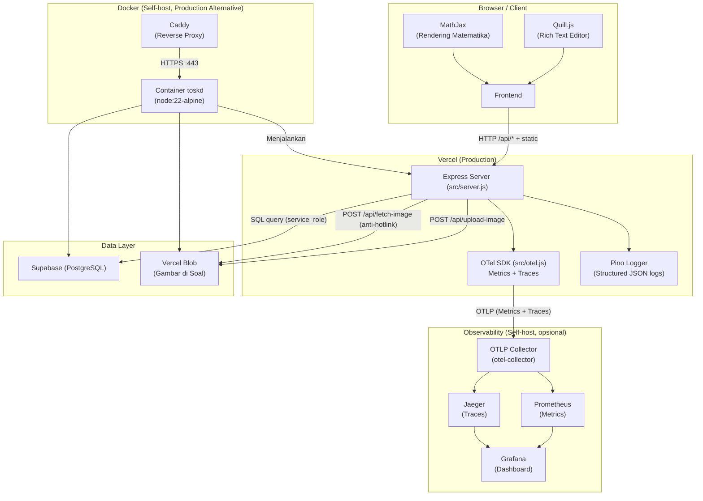

# 🚀 CAT SKD - Platform

Platform CAT (Computer Assisted Test) untuk simulasi ujian SKD (Seleksi Kompetensi Dasar). Platform ini memiliki fitur ujian real-time, pembahasan soal, scoreboard, dan pengelola bank soal.

---

## 📌 Tech Stack

| Layer | Stack |
|---|---|
| Hosting / Deploy | Vercel |
| Database | Supabase (PostgreSQL) |
| Storage | Vercel Blob (untuk gambar soal) |
| Backend | Node.js + Express |
| Frontend | HTML, CSS, VanillaJS |
| Rich Text Editor | Quill.js 1.3.7 (WYSIWYG editor dengan toolbar untuk bold, italic, image upload, dll) |
| Math Rendering | MathJax 3 CDN (support ekspresi matematika `$$\frac{a}{b}$$`) |
| Logger | Pino (Structured JSON Log) |
| Observability | OTel SDK (OTel SDK → OTLP Collector → Prometheus & Jaeger → Grafana) |

---

## 🏗️ Arsitektur Sistem



**Alur utama**:

- **Ujian**: Browser (exam.html) → `POST /api/exam/start` → `POST /api/exam/submit` → Supabase (`exam_results`) → cookie peserta utk akses hasil.
- **CMS**: Browser (protected HTML) → `requireAdmin` (cookie `toskd_admin_sess`) → CRUD soal/paket → Supabase + Vercel Blob (gambar).
- **Gambar anti-hotlink**: CMS → `/api/fetch-image` (proxy download, SSRF guard) → Vercel Blob → URL Blob dipakai di preview/exam/review.
- **Observability**: tiap request di-`tracked` → histogram golden-signals + trace → OTLP Collector → Prometheus (metrik) & Jaeger (trace) → Grafana (dashboard).

---

## ✨ Fitur Utama

### 🎯 Ujian
- Timer real-time dengan auto-submit saat waktu habis
- Scoring: TWK/TIU biner (5 poin benar / 0 salah atau tak dijawab) + TKP weighted (bobot 1–5 per opsi / 0 salah atau tak dijawab)
- Passing grade per-subtes: lulus jika SEMUA subtes mencapai ambang (default TWK=65, TIU=80, TKP=166)
- Hasil ujian dengan pembahasan lengkap

### 📝 CMS Bank Soal
- Rich Text Editor (Quill.js) untuk input soal, opsi jawaban, dan pembahasan
- Toolbar: bold, italic, underline, strike, lists, links, image upload, formula
- Upload gambar langsung ke Vercel Blob dari editor
- Preview soal dengan MathJax rendering
- Bulk Add Soal
- Drag & drop urutan soal dalam paket

### 🏆 Scoreboard
- Tabel peringkat peserta
- Filter berdasarkan paket soal
- Sorting berdasarkan skor

---

## 🔧 Rule & Logika Ujian

1. **Scoring per Soal**:
   - **TWK / TIU (biner)**: 5 poin jika jawaban benar, 0 poin jika salah/tidak dijawab
   - **TKP (bobot)**: per-soal memiliki poin (1–5), 0 poin jika tidak dijawab.
   - **Total skor absolut**: bukan persentase

2. **Paket Soal**:
   - Paket soal terdiri dari 1–3 subtes (TWK, TIU, TKP).
   - Setiap subtes dalam paket memiliki nilai passing grade masing-masing (Contoh: TWK=65, TIU=80, TKP=166).

3. **Passing Grade**:
   - Peserta "Lulus PG" jika hasil semua subtes mencapai passing grade subtes.
   - Jika hasil salah satu subtes tidak mencapai passing grade subtes, maka peserta "Tidak Lulus PG". 

4. **Limitasi Paket Soal**:
   - Minimal 1 soal, maksimal 110 soal per paket.

---

## 🚀 Deployment

### Release berbasis git tag

Deployment production Docker hanya dipicu oleh canonical stable semantic-version tag tanpa prefix `v`, misalnya `0.1.0`. Push branch hanya menjalankan CI test-only; branch tidak membangun atau mendeploy image production. Image release dipin ke tag versi dan immutable commit SHA, tanpa `latest` sebagai target deployment.

Prosedur rilis:

```bash
# Selaraskan metadata release
# package.json: "version": "0.1.0"
git tag 0.1.0
git push origin 0.1.0
```

Tag yang didukung tepat berbentuk `N.N.N`; `v0.1.0`, prerelease, dan build metadata ditolak. Rilis dengan tag/image yang sudah ada gagal dan tidak menimpa artefak lama.

`GET /health` sekarang mengembalikan `version` sebagai semantic version dan `sha` sebagai short commit SHA:

```json
{ "status": "ready", "version": "0.1.0", "sha": "abc1234" }
```

Consumer lama harus mengganti pembacaan commit SHA dari `health.version` menjadi `health.sha`.


### 1. Prerequisites

- Node.js v22+
- PNPM
- Akun Vercel & Supabase

### 2. Setup Infrastruktur

#### Supabase (Database)

1. Buat project baru di Supabase Dashboard
2. Buka **Project Settings → API** untuk mengambil:
   - **Project URL** → `SUPABASE_URL`
   - **service_role key** (JANGAN anon key) → `SUPABASE_KEY`. Wajib service_role supaya server bisa bypass RLS untuk read `password_hash` di tabel `admins`. Anon key + RLS policy "allow public read" = plaintext password leak.

#### Vercel Blob (Storage Image)

1. Buat **Blob Store** di Vercel Dashboard
2. Set access mode: **Public**
3. Copy **Blob Read/Write Token** → `BLOB_READ_WRITE_TOKEN`

### 3. Environment Variables

Buat file `.env` di root folder project:

| Variable | Nilai contoh | Keterangan |
|---|---|---|
| `SUPABASE_URL` | `https://your-project-ref.supabase.co` | Project URL |
| `SUPABASE_KEY` | `eyJhbGciOiJIUzI1NiIsInR5cCI6IkpXVCJ9...` | **service_role key (Wajib, bukan anon)** |
| `BLOB_READ_WRITE_TOKEN` | `vercel_blob_rw_xxxxxxxxxxxxxx` | Blob Read/Write Token |
| `JWT_SECRET` | `<random-32+-chars>` | Generate: `openssl rand -hex 32` |
| `COOKIE_SECURE` | `true` | Opsional — atur keamanan cookie login (lihat Catatan #3) |
| `NODE_ENV` | `production` | Opsi: `production` / `development`; **kosongkan di lokal** (auto-generate admin aktif) |
| `BOOTSTRAP_ADMIN_USERNAME` | `admin` | Opsional |
| `BOOTSTRAP_ADMIN_PASSWORD` | `<strong-password>` | Opsional |
| `LOG_LEVEL` | `info` | Opsi: `trace`/`debug`/`info`/`warn`/`error`/`fatal`/`silent` |
| `OTEL_SERVICE_NAME` | `toskd` | Opsional — nama service di Prometheus/Jaeger |
| `OTEL_EXPORTER_OTLP_ENDPOINT` | `http://otel-collector:4318` | OTLP HTTP endpoint Collector |
| `OTEL_EXPORTER_OTLP_PROTOCOL` | `http/protobuf` | Protokol OTLP (default) |
| `OTEL_METRICS_EXPORTER` | `otlp` | Opsi: `otlp` / `console` / `none` |
| `OTEL_TRACES_EXPORTER` | `otlp` | Opsi: `otlp` / `zipkin` / `console` / `none` |
| `OTEL_METRIC_EXPORT_INTERVAL` | `60000` | Interval ekspor metrics (ms) |
| `OTEL_TRACE_SAMPLE_RATIO` | `0.1` | Sampling ratio trace non-kritikal (10%) |

#### Catatan Env Variables

| No | Catatan |
|---|---|
| 1 | **Observability**: Telemetry AKTIF hanya jika `OTEL_SERVICE_NAME` DAN `OTEL_EXPORTER_OTLP_ENDPOINT` keduanya terisi (guard di `src/otel.js`). Tanpa keduanya local dev, Vercel serverless, CI OTel no-op dan aplikasi berjalan normal. toskd mengirim OTLP (metrics + traces) ke OTel Collector; toskd TIDAK mengekspos endpoint metrics sendiri. |
| 2 | **Bootstrap admin (dua mode)**: **(a) Auto-generate (default)** — biarkan `BOOTSTRAP_ADMIN_*` kosong; saat tabel `admins` kosong, server membuat user `admin` dengan password acak 20 char lalu menampilkannya **sekali** via banner `GENERATED ADMIN CREDENTIALS` di log. **(b) Eksplisit** — set `BOOTSTRAP_ADMIN_USERNAME` + `BOOTSTRAP_ADMIN_PASSWORD`; dibaca sekali di cold-start, lalu akan dibuat user admin pertama. **PENTING: DELETE kedua env var ini dari Vercel dashboard setelah admin pertama berhasil login** karena server log akan warning setiap cold-start kalau masih ada (plaintext password leak risk). |
| 3 | **`COOKIE_SECURE`**: **Kosongkan** (recommended) → otomatis: aman di `https://`, tetap berfungsi di `http://localhost` (misal Docker di komputer sendiri). Atau **isi `true`** → paksa cookie login hanya dikirim lewat koneksi aman `https://`, dipakai hanya jika situs Anda diakses lewat `https://` tapi login tetap selalu balik ke halaman login (misalnya di belakang reverse proxy HTTPS). **JANGAN isi `true` jika akses masih `http://`** malah membuat login tidak akan pernah bisa masuk. Bisa **diisi `false`** → paksa cookie boleh lewat `http://`, hanya untuk percobaan lokal; di jaringan publik berisiko (data login bisa terbaca orang lain). |

### 4. Setup Database

Jalankan query SQL di `schema.sql` melalui **Supabase SQL Editor**:

1. Buka Supabase Dashboard → project Anda
2. Klik **SQL Editor** di sidebar
3. Copy-paste seluruh isi file `schema.sql`
4. Klik **Run** untuk membuat tabel

#### Reset Password Admin

Hapus user admin yang ada, lalu biarkan server bootstrap ulang:

1. Via **Supabase SQL Editor**:
   ```sql
   DELETE FROM public.admins;
   ```
2. Restart aplikasi.
3. Admin baru dibuat otomatis saat cold-start.

### 5. Jalankan Project

```bash
# Install dependencies
pnpm install

# Jalankan development server
vercel dev           # untuk local development (auto-load .env)
# atau
pnpm start           # node src/server.js langsung (load .env via dotenv)
# atau
vercel               # untuk production deployment
```

Akses platform di [`http://localhost:3000`](http://localhost:3000).

### 6. Container

Tersedia file `Dockerfile` multi-stage yang dioptimalkan untuk containerization:

```bash
# Build image
docker build -t toskd .

# Jalankan container dengan env vars dari .env
docker run -it -p 3000:3000 --env-file .env toskd

# Atau pass env satu per satu
docker run -it -p 3000:3000 \
  -e SUPABASE_URL=... \
  -e SUPABASE_KEY=... \
  -e BLOB_READ_WRITE_TOKEN=... \
  -e JWT_SECRET=... \
  toskd
```

---

## 🔄 Backup & Restore

Prosedur menyalin seluruh data **soal**, **paket soal**, dan **scoreboard**. Tidak termasuk data user admin.

### Prerequisites

- Supabase CLI v2.113+ untuk subcommand `db query`.
- `supabase login` untuk access token.
- Project ref tiap environment (cek `supabase projects list`).
- `psql` terpasang untuk restore local (karena limitasi `supabase db query --local` yaitu CLI mengeksekusi seluruh isi file sebagai single prepared statement, dan PostgreSQL menolak lebih dari satu command dalam satu prepared statement).

### 1. Backup

```bash
supabase project list
supabase link --project-ref <REF_PROJECT_X>
mkdir -p backups
supabase db dump --data-only --linked -x public.admins -f backups/all-data.sql
```

### 2. Restore ke remote project Supabase

```bash
supabase project list
supabase link --project-ref <REF_PROJECT_Y>
# Bersihkan data lama dev (tanpa menyentuh data user admin)
supabase db query --linked \
  "TRUNCATE pack_questions, exam_results, questions, question_packs RESTART IDENTITY CASCADE;"
# Restore
supabase db query --linked -f backups/all-data.sql
```

### 3. Restore ke Supabase local

```bash
supabase start
DB_URL=$(supabase status -o env 2>/dev/null | grep '^DB_URL=' | cut -d= -f2- | tr -d '"')
# Bersihkan data lama local
psql "$DB_URL" -c "TRUNCATE pack_questions, exam_results, questions, question_packs RESTART IDENTITY CASCADE;"
# Restore
psql "$DB_URL" -v ON_ERROR_STOP=1 -f backups/all-data.sql
```

Tanpa `psql` terpasang, bisa langsung lewat container local:

```bash
docker exec -i supabase_db_toskd psql -U postgres -d postgres < backups/all-data.sql
```

### 4. Verifikasi

```bash
psql "$DB_URL" -c "
  SELECT (SELECT count(*) FROM questions)      AS soal,
         (SELECT count(*) FROM question_packs) AS paket,
         (SELECT count(*) FROM pack_questions) AS relasi,
         (SELECT count(*) FROM exam_results)   AS hasil_ujian;"
```

Bandingkan angkanya dari Supabase `REF_PROJECT_X` dan `REF_PROJECT_Y` harus sama persis.


